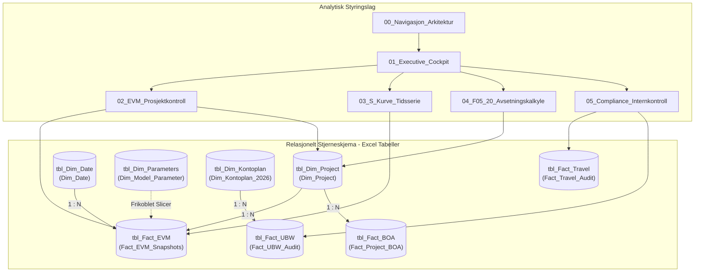

# Excel Data Model Specification (UiA Controller 2026)

**Application:** UiA Handelshøyskolen Enterprise Financial Controlling & EVM Model  
**Target Format:** Microsoft Excel (`.xlsx`) with Structured Tables (`ListObject`), Power Pivot & Power Query Ready  
**Primary File:** [`excel/UiA_Controller_DataModel_2026.xlsx`](file:///C:/Users/frank/Desktop/UIA-Controller/excel/UiA_Controller_DataModel_2026.xlsx)  
**Report Mirror:** [`data/reports/UiA_Controller_DataModel_2026.xlsx`](file:///C:/Users/frank/Desktop/UIA-Controller/data/reports/UiA_Controller_DataModel_2026.xlsx)  
**Generator Script:** [`src/tools/generate_excel_datamodel.py`](file:///C:/Users/frank/Desktop/UIA-Controller/src/tools/generate_excel_datamodel.py)  
**Design Standard:** Edward Tufte Data-Ink Ratio, ANSI/EIA-748 EVM, KD Rundskriv F-05-20, Statens Kontoplan (R-102)  

---

## 1. Datamodellarkitektur (14 Arbeidsark)

Arbeidsboken er strukturert i to lag:
1. **Analytiske Brukergrensesnitt & Dashboards (Fane 00–05)**: Ledelsesrapportering, dynamisk EVM-beregning, kumulativ S-kurve, F-05-20 avsetningssimulator og revisjonsoversikter.
2. **Relasjonelt Stjerneskjema (Fane 06–13)**: 8 strukturerte Excel-tabeller (`ListObject`) med navngitte referanser klare for Power Pivot, Power Query eller direkte formeloppslag (`XLOOKUP`, `SUMIFS`).



---

## 2. Oversikt over Arbeidsark & Funksjonalitet

| Fane | Type | Tabellnavn (`ListObject`) | Beskrivelse & Formål |
| :--- | :--- | :--- | :--- |
| **`00_Navigasjon_Arkitektur`** | Portal | N/A | Executive portal med systemparametere, versjonskontroll, dataflytkilder og hyperlenker til alle faner. |
| **`01_Executive_Cockpit`** | Dashboard | N/A | Overordnet ledelsesrapport for Fakultetsdirektør/Dekan med KPI-kort, dynamisk EAC-modellslicer (celle `B19`), og P1/P2 tiltaksplan. |
| **`02_EVM_Prosjektkontroll`** | Analyse | `tbl_EVM_Analysis` | Prosjekt-for-prosjekt EVM analyse (`UM-DEF-02`, `UM-ENG-03`, `UM-FPV-01`, samt BOA-prosjekter) med CPI, SPI, EAC (3 modeller), VAC og TCPI. |
| **`03_S_Kurve_Tidsserie`** | Tidsserie | `tbl_TimeSeries` | Månedlig kumulativ PV/EV/AC historikk for 2026 (M01–M12) og innebygd Edward Tufte-formatert linjediagram (S-kurve). |
| **`04_F05_20_Avsetningskalkyle`** | Modell | N/A | Kunnskapsdepartementets 5 % tak (F-05-20). Viser 12M NOK overskridelse per M10 og interaktiv what-if tiltakssimulator (T1–T4). |
| **`05_Compliance_Internkontroll`** | Revisjon | `tbl_Travel_Audit` | DFØ reiseregningsskann (15 saker) og UBW transaksjonskontroll (4-øyne-brudd, måltidsfradrag, bilagskrav og Unit4 sperrelister). |
| **`Dim_Project`** | Dimensjon | `tbl_Dim_Project` | Prosjekt-stamdata: ID, navn, avdeling, prosjektleder, kategori, godkjent BAC og status. |
| **`Dim_Date`** | Dimensjon | `tbl_Dim_Date` | Komplett 365-dagers finanskalender for 2026 med måned, kvartal og `ReportingPeriod`. |
| **`Dim_Model_Parameter`** | Dimensjon | `tbl_Dim_Parameters` | EAC-modellparametere, formeldefinisjoner og vekting (`CPI`, `COMPOSITE`, `WEIGHTED 80/20`). |
| **`Fact_EVM_Snapshots`** | Fakta | `tbl_Fact_EVM` | Porteføljesnapshots fra DuckDB med historiske EVM-målinger. |
| **`Fact_UBW_Audit`** | Fakta | `tbl_Fact_UBW` | Hovedbokstransaksjoner fra SQLite med live 4-øyne formelkontroll: `=IF([@bdm_id]=[@attestant_id], "BRUDD...", "OK")`. |
| **`Fact_Travel_Audit`** | Fakta | `tbl_Fact_Travel` | 15 DFØ reiseregninger med detaljerte revisjonsavvik, diettreisefradrag og sperrestatus. |
| **`Fact_Project_BOA`** | Fakta | `tbl_Fact_BOA` | Bidrags- og oppdragsforskning (NFR, EU, Oppdrag) med overhead, dekningsgrad og SRS 9/10 klassifisering. |
| **`Dim_Kontoplan_2026`** | Dimensjon | `tbl_Dim_Kontoplan` | Standard Statens Kontoplan (R-102) med SRS-koblinger og kontogrupper (1–9). |

---

## 3. Sentrale Excel-Formler & Beregningslogikk

### 3.1 EVM Målinger (`02_EVM_Prosjektkontroll`)
- **Cost Variance (CV):** `=EV - AC` (`=E5-F5`)
- **Schedule Variance (SV):** `=EV - PV` (`=E5-D5`)
- **Cost Performance Index (CPI):** `=IFERROR(EV / AC, 1.00)` (`=IFERROR(E5/F5, 1.00)`)
- **Schedule Performance Index (SPI):** `=IFERROR(EV / PV, 1.00)` (`=IFERROR(E5/D5, 1.00)`)
- **EAC Typisk CPI:** `=IFERROR(BAC / CPI, BAC)` (`=IFERROR(C5/I5, C5)`)
- **EAC Sammensatt (CPI x SPI):** `=IFERROR(AC + (BAC - EV)/(CPI * SPI), BAC)` (`=IFERROR(F5+(C5-E5)/(I5*J5), C5)`)
- **EAC Vektet 80/20:** `=IFERROR(AC + (BAC - EV)/(0.8*CPI + 0.2*SPI), BAC)` (`=IFERROR(F5+(C5-E5)/(0.8*I5+0.2*J5), C5)`)
- **Dynamisk EAC (Styrt av Slicer):**  
  `=IF('01_Executive_Cockpit'!$B$19="CPI", K5, IF('01_Executive_Cockpit'!$B$19="COMPOSITE", L5, M5))`
- **Variance at Completion (VAC):** `=BAC - EAC_Aktiv` (`=C5-N5`)
- **Estimate to Complete (ETC):** `=EAC_Aktiv - AC` (`=N5-F5`)
- **To-Complete Performance Index (TCPI):** `=IFERROR((BAC - EV)/(BAC - AC), 9.99)` (`=IFERROR((C5-E5)/(C5-F5), 9.99)`)
- **Risikostatus:**  
  `=IF(OR(I5<0.85, J5<0.85, O5<-1000000), "CRITICAL", IF(OR(I5<0.95, J5<0.95), "WARNING", "ON TRACK"))`

### 3.2 F-05-20 Driftsavsetningskalkyle (`04_F05_20_Avsetningskalkyle`)
- **Lovfestet 5 % Tak:** `=B6 * 0.05` (60 000 000 NOK)
- **Reell Driftsavsetning per M10:** `72 000 000 NOK` (6,00 % av rammen)
- **Overskridelse:** `=MAX(0, B8 - B7)` (12 000 000 NOK over taket)
- **Revidert EOY Sluttbalanse etter Tiltak:** `=B21 - SUM(C14:C17)`
- **Revidert Dispensasjonsstatus:**  
  `=IF(B23<=B7, "MÅL OPPNÅDD: INNENFOR 5,0 % GRENSE", "FORTSATT DISPENSASJONSBEHOV")`

### 3.3 Revisjon & Segregering av Plikter (`Fact_UBW_Audit`)
- **4-øyne-prinsipp sjekk:**  
  `=IF(E2=F2, "BRUDD: Egengodkjenning", IF(G2=0, "MANGLER BILAG", "OK"))`

---

## 4. Edward Tufte Data-Ink Retningslinjer

1. **Rutenett & Rammer:**
   - Standard vertikale rutenett i tabeller er fjernet for å redusere visuell støy.
   - Det benyttes utelukkende diskrete horisontale skillelinjer (`#CBD5E1`) og dobbel bunnlinje for totalsummer.
2. **Fargebruk & Kontrast:**
   - Mørk skifergrå tittel- og topptekstfyll (`#1E293B`, `#334155`) med hvit fet skrift.
   - Dempet zebrastriping (`#F8FAFC`) på datatabeller.
   - Interaktive brukerinndata er tydelig markert med lys blå bakgrunn (`#E0F2FE`) og tynn ramme.
   - Sterke signalfarger brukes kun funksjonelt:
     - Grønn (`#D1FAE5` / `#065F46`): I rute / Godkjent
     - Gul (`#FEF3C7` / `#92400E`): Advarsel / Moderat avvik
     - Rød (`#FEE2E2` / `#991B1B`): Kritisk avvik / Dispensasjon påkrevd / Utbetalingssperre
3. **Numerisk Justering:**
   - Alle tallformater og valutaer er høyrejustert med tusenseparator (`#,##0 "NOK"`).
   - Tekst og beskrivelser er venstrejustert.
   - Prosjekt-IDer, perioder og statusflagg er sentrert i `Consolas` skrift.

---

## 5. Integrasjon med Power BI og Power Query

Fordi alle backend-faner er registrert som offisielle **Excel-tabeller (`ListObject`)**, kan modellen umiddelbart konsumeres av eksterne BI-verktøy:

- **Power Query i Excel / Power BI:**
  ```powerquery
  let
      Source = Excel.CurrentWorkbook(){[Name="tbl_Fact_EVM"]}[Content]
  in
      Source
  ```
- **Power Pivot:**
  Gå til **Power Pivot -> Add to Data Model**. Tabellene oppretter automatisk relasjoner via primærnøklene (`project_id`, `ReportingPeriod`, `ModelCode`, `transaksjon_id`).
