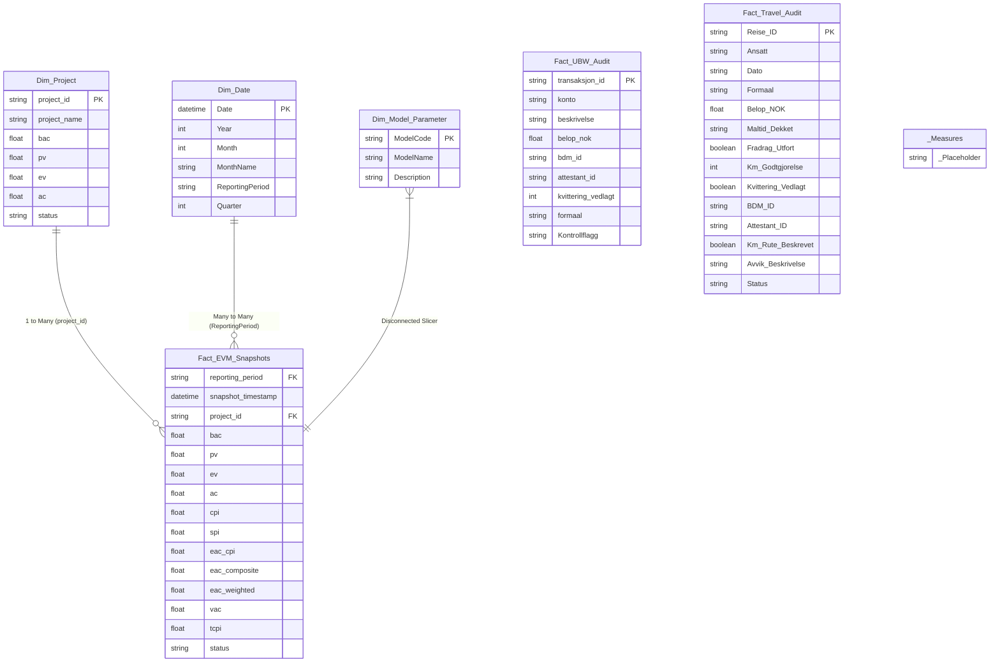

# Power BI Data Model Specification (Star Schema)

**Application:** UiA Controller App & PBIP Data Model  
**Target Engine:** Power BI Desktop / Microsoft Fabric PBIP (TMDL Format)  
**Project File:** [`powerbi/Controller project.pbip`](file:///C:/Users/frank/Desktop/UIA-Controller/powerbi/Controller%20project.pbip)  
**Semantic Model:** [`powerbi/Controller project.SemanticModel/definition/`](file:///C:/Users/frank/Desktop/UIA-Controller/powerbi/Controller%20project.SemanticModel/definition/)  
**Design Standard:** Edward Tufte Data-Ink & Star Schema Dimensional Modeling  

---

## 1. Star Schema Relationship Architecture

---

## 2. Model Tables & Relationships Summary

| Primary Table (1) | Foreign Table (N) | Primary Key | Foreign Key | Cardinality | Cross Filter Direction |
| :--- | :--- | :--- | :--- | :---: | :---: |
| `Dim_Project` | `Fact_EVM_Snapshots` | `project_id` | `project_id` | 1 : N | Single (`Dim_Project` -> `Fact`) |
| `Dim_Date` | `Fact_EVM_Snapshots` | `ReportingPeriod` | `reporting_period` | M : N | Both (`Dim_Date` <-> `Fact`) |
| `Dim_Model_Parameter` | *(Disconnected)* | `ModelCode` | N/A | Slicer | Disconnected Parameter Table |
| `Fact_UBW_Audit` | *(Audit Ledger)* | `transaksjon_id` | N/A | Fact | Self-contained UBW journal audit |
| `Fact_Travel_Audit` | *(Audit Ledger)* | `Reise_ID` | N/A | Fact | Self-contained DFØ travel claim audit |
| `_Measures` | *(Repository)* | `_Placeholder` | N/A | Container | 29 DAX metrics in 5 display folders |

---

## 3. TMDL File Layout & Semantic Model Components

The semantic model is serialized in TMDL (Tabular Model Definition Language) under [`powerbi/Controller project.SemanticModel/definition/`](file:///C:/Users/frank/Desktop/UIA-Controller/powerbi/Controller%20project.SemanticModel/definition/):

- [`database.tmdl`](file:///C:/Users/frank/Desktop/UIA-Controller/powerbi/Controller%20project.SemanticModel/definition/database.tmdl): Compatibility level 1606.
- [`model.tmdl`](file:///C:/Users/frank/Desktop/UIA-Controller/powerbi/Controller%20project.SemanticModel/definition/model.tmdl): Model metadata, culture `en-US`, query order annotations, and table references.
- [`relationships.tmdl`](file:///C:/Users/frank/Desktop/UIA-Controller/powerbi/Controller%20project.SemanticModel/definition/relationships.tmdl): Model relationships linking dimensions to facts.
- **`tables/`**:
  - [`Dim_Project.tmdl`](file:///C:/Users/frank/Desktop/UIA-Controller/powerbi/Controller%20project.SemanticModel/definition/tables/Dim_Project.tmdl)
  - [`Dim_Date.tmdl`](file:///C:/Users/frank/Desktop/UIA-Controller/powerbi/Controller%20project.SemanticModel/definition/tables/Dim_Date.tmdl)
  - [`Dim_Model_Parameter.tmdl`](file:///C:/Users/frank/Desktop/UIA-Controller/powerbi/Controller%20project.SemanticModel/definition/tables/Dim_Model_Parameter.tmdl)
  - [`Fact_EVM_Snapshots.tmdl`](file:///C:/Users/frank/Desktop/UIA-Controller/powerbi/Controller%20project.SemanticModel/definition/tables/Fact_EVM_Snapshots.tmdl)
  - [`Fact_UBW_Audit.tmdl`](file:///C:/Users/frank/Desktop/UIA-Controller/powerbi/Controller%20project.SemanticModel/definition/tables/Fact_UBW_Audit.tmdl)
  - [`Fact_Travel_Audit.tmdl`](file:///C:/Users/frank/Desktop/UIA-Controller/powerbi/Controller%20project.SemanticModel/definition/tables/Fact_Travel_Audit.tmdl)
  - [`_Measures.tmdl`](file:///C:/Users/frank/Desktop/UIA-Controller/powerbi/Controller%20project.SemanticModel/definition/tables/_Measures.tmdl)

---

## 4. DAX Measure Library Structure (29 Measures)

Measures are partitioned into 5 display folders in `_Measures`:

1. **`01 Core EVM`**:
   - `[Total BAC]`: Total Budget at Completion (`SUM(bac)`).
   - `[Total PV]`: Total Planned Value (`SUM(pv)`).
   - `[Total EV]`: Total Earned Value (`SUM(ev)`).
   - `[Total AC]`: Total Actual Cost (`SUM(ac)`).
   - `[Cost Variance NOK]`: Cost Variance (`[Total EV] - [Total AC]`).
   - `[Schedule Variance NOK]`: Schedule Variance (`[Total EV] - [Total PV]`).
   - `[Portfolio CPI]`: Cost Performance Index (`DIVIDE([Total EV], [Total AC], 1.0)`).
   - `[Portfolio SPI]`: Schedule Performance Index (`DIVIDE([Total EV], [Total PV], 1.0)`).

2. **`02 EAC Forecasting`**:
   - `[EAC Typical CPI]`: Standard CPI projection (`[Total BAC] / [Portfolio CPI]`).
   - `[EAC Composite CPI_SPI]`: Composite index factoring schedule delay (`AC + (BAC - EV)/(CPI*SPI)`).
   - `[EAC Weighted 80_20]`: 80% cost / 20% schedule weighted index (`AC + (BAC - EV)/(0.8 CPI + 0.2 SPI)`).
   - `[EAC Selected Model]`: Dynamic EAC model switcher driven by `Dim_Model_Parameter[ModelCode]`.
   - `[VAC Selected Model]`: Variance at Completion for selected model (`[Total BAC] - [EAC Selected Model]`).

3. **`03 TCPI & Risk`**:
   - `[TCPI Target BAC]`: To-Complete Performance Index to meet original budget (`(BAC - EV)/(BAC - AC)`).
   - `[Project Risk Status]`: Dynamic project evaluation (`CRITICAL`, `WARNING`, `ON TRACK`).
   - `[Status Color Hex]`: Edward Tufte-compliant status hex codes (`#ef4444`, `#f59e0b`, `#34d399`, `#94a3b8`).

4. **`04 F-05-20 Reserve Cap`**:
   - `[Statlig Rammebevilgning NOK]`: 1.2 Mrd NOK (Kap. 260 post 50).
   - `[Reell Driftsavsetning NOK]`: 72 MNOK accumulated carryover.
   - `[Reserve Share Pct]`: 6.0% reserve share.
   - `[Reserve Cap 5% Limit NOK]`: 60 MNOK statutory threshold.
   - `[Reserve Cap Excess NOK]`: 12 MNOK excess subject to KD clawback.
   - `[F-05-20 Status Flag]`: `DISPENSASJON PÅKREVD` alert flag.

5. **`05 Compliance & Audit`**:
   - `[Total Scanned Claims Count]`: Total travel claims audited (`COUNTROWS('Fact_Travel_Audit')`).
   - `[Flagged Claims Count]`: Total travel claims flagged with compliance findings.
   - `[Total Flagged Amount NOK]`: Total monetary exposure of flagged travel claims.
   - `[Self-Approval Breach Amount NOK]`: Exposure of 4-eyes principle violations (`BDM_ID == Attestant_ID`).
   - `[Total UBW Transactions Count]`: Total UBW journal ledger lines scanned.
   - `[Total UBW Amount NOK]`: Total transaction volume in NOK.
   - `[Flagged UBW Transactions Count]`: Flagged general ledger entries (`Kontrollflagg <> "OK"`).

---

## 5. Visual Styling Guidelines (Edward Tufte Data-Ink)

* **Canvas Background:** `#0F172A` (Slate Dark)
* **Card Background:** `#1E293B`
* **Typography:** `Inter` (Labels/Headers), `JetBrains Mono` (Numeric data/KPIs)
* **Color Hierarchy:**
  * Neutral Data Ink: `#F8FAFC` (High contrast text), `#94A3B8` (Muted axis/grid labels)
  * Primary Series: `#38BDF8` (Planned Value & Earned Value lines)
  * Positive Variance: `#34D399` (Favorable variance / On Track)
  * Warning Status: `#F59E0B` (Amber / Minor variance)
  * Critical Status: `#EF4444` (Overrun / Clawback risk)
* **Table Design:** No vertical gridlines, right-aligned numbers, left-aligned text, no drop shadows.

---

## 6. How to Open in Power BI Desktop

1. Open **Power BI Desktop** (latest release with PBIP / TMDL support enabled in Preview Features).
2. Click **File -> Open report** and browse to:
   [`powerbi/Controller project.pbip`](file:///C:/Users/frank/Desktop/UIA-Controller/powerbi/Controller%20project.pbip)
3. Power BI Desktop will automatically compile the TMDL model from `Controller project.SemanticModel/definition/`.
4. Click **Refresh** to ingest the latest Parquet snapshots from [`data/staging/parquet/`](file:///C:/Users/frank/Desktop/UIA-Controller/data/staging/parquet/).
