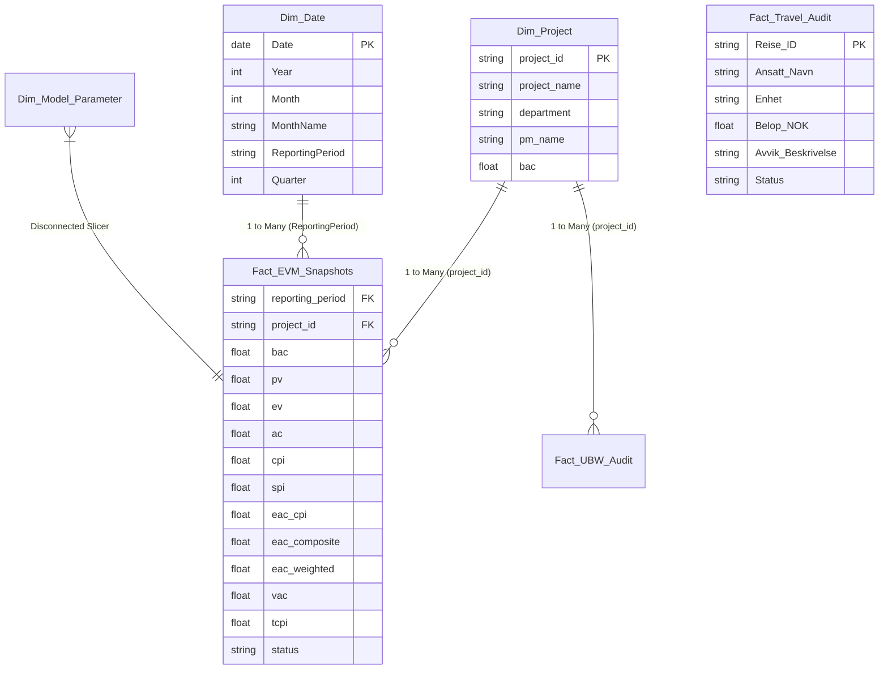

# Power BI Data Model Specification (Star Schema)

**Application:** UiA Controller App (v12 Canonical)  
**Target Engine:** Power BI Desktop / Analysis Services Tabular  
**Design Standard:** Tufte Data-Ink & Star Schema Dimensional Modeling  

---

## 1. Star Schema Relationship Architecture

---

## 2. Model Tables & Relationships Summary

| Primary Table (1) | Foreign Table (N) | Primary Key | Foreign Key | Cardinality | Cross Filter Direction |
| :--- | :--- | :--- | :--- | :---: | :---: |
| `Dim_Project` | `Fact_EVM_Snapshots` | `project_id` | `project_id` | 1 : N | Single (`Dim_Project` -> `Fact`) |
| `Dim_Project` | `Fact_UBW_Audit` | `project_id` | `project_id` | 1 : N | Single (`Dim_Project` -> `Fact`) |
| `Dim_Date` | `Fact_EVM_Snapshots` | `ReportingPeriod` | `reporting_period` | 1 : N | Single (`Dim_Date` -> `Fact`) |
| `Dim_Model_Parameter` | *(Disconnected)* | N/A | N/A | Slicer | Disconnected Parameter Table |

---

## 3. Power BI Visual Page Layout & Palette

* **Theme Background:** `#0F172A` (Slate Dark)
* **Card Background:** `#1E293B`
* **Typography:** `Inter` (Labels), `JetBrains Mono` (Numeric Data)
* **Color Rules (Tufte Compliant):**
  * Neutral Data Ink: `#F8FAFC` (White), `#94A3B8` (Muted Gray)
  * Primary Series: `#38BDF8` (Blue)
  * Positive Variance: `#34D399` (Green)
  * Warning Status: `#F59E0B` (Amber)
  * Critical Status / Risk: `#EF4444` (Red)

---

## 4. Setup Instructions

1. Open **Power BI Desktop**.
2. Go to **Get Data** -> **Parquet** (or **CSV**).
3. Select the exported files from:
   `C:\Users\frank\Desktop\UIA-Controller\md_files\uia-controller-app-v12\uia-controller-app\data\staging\parquet\`
4. Paste the DAX measures from [`powerbi/dax_measures.dax`](file:///c:/Users/frank/Desktop/UIA-Controller/powerbi/dax_measures.dax) into a dedicated `_Measures` table.
5. Create relationships according to the table above.
