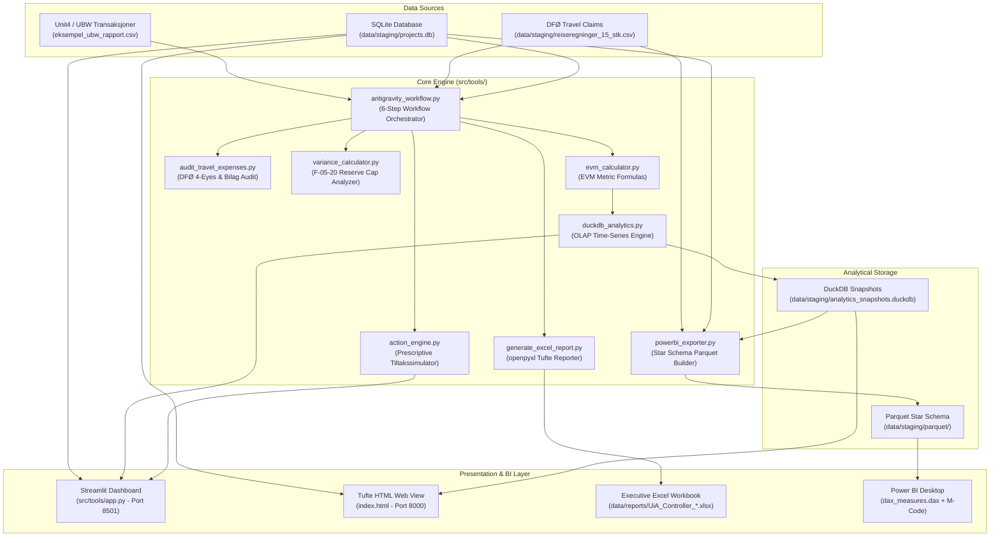

# UiA Controller App — Comprehensive User & Operations Guide (v15)

**Application:** UiA Controller App  
**Release:** v15.0 Canonical Production Release  
**Target Roles:** Lead Financial Controller, Compliance Auditor, Ledger Analyst, Excel Specialist, Power BI Specialist  
**Domain:** Universitetet i Agder (UiA) Handelshøyskolen / Public Sector Financial Controlling & EVM Project Governance  

---

## 📑 Table of Contents

1. [System Overview & Architecture](#1-system-overview--architecture)
2. [Prerequisites & Environment Setup](#2-prerequisites--environment-setup)
3. [Directory Layout & File Mapping](#3-directory-layout--file-mapping)
4. [Automated Month-End Close Workflow](#4-automated-month-end-close-workflow)
5. [Interactive Streamlit Web Dashboard](#5-interactive-streamlit-web-dashboard)
6. [Tufte Data-Ink HTML Dashboard](#6-tufte-data-ink-html-dashboard)
7. [Executive Excel Report Generator](#7-executive-excel-report-generator)
8. [Power BI Star Schema & DAX Integration](#8-power-bi-star-schema--dax-integration)
9. [Financial Controlling Formulas & Compliance Reference](#9-financial-controlling-formulas--compliance-reference)
10. [Automated Verification & Pytest Suite](#10-automated-verification--pytest-suite)
11. [Troubleshooting & FAQ](#11-troubleshooting--faq)

---

## 1. System Overview & Architecture

The **UiA Controller App** bridges Norwegian public sector statutory governance (**DFØ circulars, UBW/Unit4 general ledger, Kunnskapsdepartementet Rundskriv F-05-20**) with capital project performance tracking (**Earned Value Management (EVM), multi-model EAC forecasting, DuckDB OLAP time-series**) and modern BI data modeling (**Power BI Star Schema, Tufte Excel reports, Streamlit simulation**).

### Architecture Diagram



---

## 2. Prerequisites & Environment Setup

### System Prerequisites
* **Operating System:** Windows 10/11, macOS, or Linux (Ubuntu 22.04+).
* **Python Runtime:** Python 3.10, 3.11, or 3.12+ (Python 3.14 compatible).
* **Modern Web Browser:** Chrome, Edge, Safari, or Firefox.

### Step 1: Clone or Open Project
```bash
cd C:\Users\frank\Desktop\UIA-Controller
```

### Step 2: Configure Virtual Environment
```bash
# Create local virtual environment
python -m venv .venv

# Activate environment (Windows PowerShell)
.venv\Scripts\Activate.ps1

# Activate environment (Linux / macOS)
source .venv/bin/activate
```

### Step 3: Install Required Dependencies
```bash
pip install --upgrade pip
pip install -r requirements.txt
```

### Step 4: Verify Installation
```bash
python -m pytest tests -v
```
All 13 automated tests should pass cleanly in under 2 seconds.

---

## 3. Directory Layout & File Mapping

```
UIA-Controller/
├── Dockerfile                          # Multi-stage Docker build specification
├── docker-compose.yml                  # Local container orchestration
├── pyproject.toml                      # Standard Python packaging configuration
├── requirements.txt                    # Pinned core & visualization dependencies
├── index.html                          # Tufte-compliant single-page HTML dashboard
├── README.md                           # Main repository landing documentation
├── .gitignore                          # Clean git exclusions (caches, virtualenvs)
├── .github/workflows/ci.yml            # Automated CI verification workflow
├── .agents/                            # Antigravity agent roles & controller skills
│   ├── agents.md                       # Role definitions (Lead Controller, Auditor, Analyst)
│   └── skills/                         # Skill specs (EVM, DFØ, UBW, F-05-20, Power BI)
├── .antigravity/                       # Knowledge base & controlling SOPs
├── workflows/                          # Standardized month-end execution guides
│   ├── run_close.md                    # Step-by-step /manedsavslutning SOP
│   └── implementation_plan_revisjon.md # Audit revision plan
├── src/tools/                          # Production controller calculation tools
│   ├── action_engine.py                # Tiltakssimulator, descoping & EOY forecast
│   ├── antigravity_workflow.py         # 6-step consolidated month-end close runner
│   ├── app.py                          # Streamlit web dashboard with interactive sliders
│   ├── audit_travel_expenses.py        # DFØ travel expense compliance audit
│   ├── duckdb_analytics.py             # DuckDB OLAP snapshotting & multi-model EAC
│   ├── evm_calculator.py               # Earned Value Management metric formulas
│   ├── generate_excel_report.py        # openpyxl Tufte-compliant Excel report builder
│   ├── powerbi_exporter.py             # Star Schema Parquet & CSV exporter
│   ├── ubw_reader.py                   # Unit4 / UBW transaction audit reader
│   └── variance_calculator.py          # F-05-20 reserve & variance analysis
├── powerbi/                            # Power BI dataset automation & modeling
│   ├── build_powerbi_dataset.py        # Automated export & manifest generator
│   ├── dax_measures.dax                # 20+ DAX measures library
│   ├── manifest.json                   # Export manifest metadata
│   ├── power_query_m_code.m            # Power Query M ingestion script
│   └── UiA_Controller_DataModel_Spec.md# Star Schema architectural documentation
├── data/                               # Staging databases, raw inputs, and reports
│   ├── reports/                        # Output directory for generated Excel reports
│   │   └── UiA_Controller_Maanedsoppgjoer_2026-M10.xlsx
│   ├── staging/                        # Operational databases & audit CSV files
│   │   ├── projects.db                 # SQLite transactional database
│   │   ├── analytics_snapshots.duckdb  # DuckDB OLAP time-series database
│   │   ├── reiseregninger_15_stk.csv   # DFØ travel claims test data
│   │   ├── eksempel_ubw_rapport.csv    # Sample UBW ledger data
│   │   └── parquet/                    # Exported Star Schema Parquet/CSV tables
│   └── *.csv                           # Institutional dimension & fact datasets
├── docs/                               # Documentation, reports, and user guides
│   ├── USER_GUIDE.md                   # This comprehensive manual
│   ├── architecture/                   # AI & agentic office design notes
│   ├── guides/                         # Setup guides (Streamlit, Power BI)
│   └── reports/                        # Executive summaries & audit walkthroughs
├── Regelverk/                          # Norwegian statutory regulations & guidelines
│   ├── notater/                        # Structured summaries of state regulations
│   └── *.pdf, *.xlsx                   # DFØ circulars, SRS, F-05-20, UiA control matrices
└── tests/                              # Automated test suite (13 test cases)
```

---

## 4. Automated Month-End Close Workflow

The consolidated month-end close orchestrator is located at [`src/tools/antigravity_workflow.py`](file:///C:/Users/frank/Desktop/UIA-Controller/src/tools/antigravity_workflow.py). It automates the full controller cycle in 6 deterministic steps:

### Execution Command
```bash
python src/tools/antigravity_workflow.py
```

### The 6 Workflow Steps Explained

```plaintext
[1/6] Auditoria: Skanner UBW og reiseregninger for avvik
      - Verifiserer fire-øyne-prinsippet (BDM != Attestant).
      - Kontrollerer bilag > 100 kr og måltidsfradrag (20/30/50 %).
      - Funn: 2 UBW-avvik, 7 av 15 reiseregninger flagget (19 420 NOK berørt).

[2/6] Analyst: Beregner F-05-20 Driftsavsetningsstatus
      - Sjekker akkumulert avsetning (72 mill. NOK) mot 5.0 % av rammebevilgningen (60 mill. NOK).
      - Funn: 6.0 % reell avsetning -> 12 000 000 NOK overskridelse krever KD-søknad.

[3/6] Lead Controller: Databaseintegrert EVM-prosjektanalyse
      - Leser inn prosjekter fra SQLite projects.db.
      - Beregner CPI, SPI, CV, SV, EAC, VAC, TCPI for alle prosjekter.
      - Flagg: UM-ENG-03 (CPI 0.76, TCPI 2.14) og UM-FPV-01 (CPI 0.91) flagget CRITICAL.

[4/6] DuckDB Engine: Lagrer tidsrekke-snapshot & Fler-modell EAC-prognoser
      - Skriver periodisk snapshot til data/staging/analytics_snapshots.duckdb.
      - Beregner 3 parallelle prognosemodeller:
        * EAC (Typical CPI)
        * EAC (Composite CPI * SPI)
        * EAC (Weighted 80/20)

[5/6] Action Engine: Genererer tiltaksplan, kvantifiserer effekter & revidert EOY
      - Simulerer 20 % descoping på kritiske prosjekter (sparer 6,07 mill. NOK).
      - Aktiverer 12 mill. NOK utstyrsinvesteringer før 31.12.
      - EOY-resultat: Avsetning senket fra 6.0 % til nøyaktig 5.0 % (COMPLIANT).

[6/6] Power BI Integration: Eksporterer Star Schema til Parquet og CSV
      - Genererer Fact_EVM_Snapshots, Fact_UBW_Audit, Fact_Travel_Audit, Dim_Project, Dim_Date.
      - Lagrer optimaliserte Parquet-filer i data/staging/parquet/.
```

---

## 5. Interactive Streamlit Web Dashboard

The Streamlit dashboard located at [`src/tools/app.py`](file:///C:/Users/frank/Desktop/UIA-Controller/src/tools/app.py) provides a modern, interactive simulation environment for executive leadership and controllers.

### Launching the Dashboard
```bash
streamlit run src/tools/app.py
```
*The application opens automatically in your default browser at `http://localhost:8501`.*

### Features & Interactive Controls

#### 1. Sidebar Parameter Sliders (Prescriptive Tiltakssimulator)
* **Descoping / Kostnadskutt i ETC (%):** Slider from 0% to 50% (default 20%). Dynamically scales down remaining estimated costs for critical projects `UM-ENG-03` and `UM-FPV-01`.
* **Aktiverte Investeringer før 31.12 (NOK):** Slider from 0 to 20,000,000 NOK (default 12,000,000 NOK). Reallocates operating surplus into approved capital equipment investments, directly reducing the F-05-20 reserve.
* **Stans og Retur av Feilførte Reiseregninger (%):** Slider from 0% to 100% (default 100%). Halts unauthorized claims and recovers miscalculated meal allowances.
* **Søknad om KD-dispensasjon:** Checkbox to reflect formal application to Kunnskapsdepartementet for strategic reserve carryover.

#### 2. Main Area: 4 Interactive Tabs
* **Fane 1: 📊 Revidert EOY Balanse & Resultat:**
  * Executive metric cards showing revised reserve percentage, surplus reduction, direct cost savings, and regulatory compliance badge.
  * Side-by-side reconciliation table: Status Quo vs. Revised Forecast.
* **Fane 2: 📈 EVM Prosjektstyring & Descoping Simulator:**
  * Comprehensive EVM portfolio table with BAC, AC, CPI, SPI, Baseline EAC, Revised EAC, and TCPI.
  * Dynamic visual comparison showing cost recovery per project after descoping.
* **Fane 3: ⚖️ F-05-20 Avsetningskontroll:**
  * Visual threshold indicator displaying the statutory 5.0% cap vs. actual carryover.
  * Regulatory guidance on capital investment activation vs. operating reserves.
* **Fane 4: 🔍 Internkontroll & Reiseregninger:**
  * Granular audit table of all 15 travel claims with badges indicating specific infractions (`BRUDD_FIRE_OYNE`, `BRUDD_MALTID`, `BRUDD_KM_RUTE`, `BRUDD_KVITTERING`).

---

## 6. Tufte Data-Ink HTML Dashboard

For lightweight, zero-dependency local viewing, the project includes [`index.html`](file:///C:/Users/frank/Desktop/UIA-Controller/index.html) adhering strictly to Edward Tufte's Data-Ink Maximization principles.

### Launching the HTML Server
```bash
python -m http.server 8000
```
*Open `http://localhost:8000` in your web browser.*

### Design Standards Implemented
* **Zero Drop Shadows & Decorative Icons:** Clean slate dark aesthetic (`#0F172A`).
* **Zero Vertical Table Borders:** Clear horizontal separation with subtle hairline dividers.
* **Numeric Typography:** Right-aligned monetary figures with vertically aligned decimal places in tabular numbers (`font-variant-numeric: tabular-nums`).
* **Direct Labeling:** Direct annotations on S-Curves and progress indicators instead of detached legends.
* **Variance Highlighting:** Muted neutral baseline with vivid highlight accents for active variances (Red `#EF4444` for Critical, Amber `#F59E0B` for Warning, Green `#34D399` for Compliant).

---

## 7. Executive Excel Report Generator

The dynamic openpyxl Excel builder is located at [`src/tools/generate_excel_report.py`](file:///C:/Users/frank/Desktop/UIA-Controller/src/tools/generate_excel_report.py).

### Running the Generator
```bash
python src/tools/generate_excel_report.py
```
*Generates [`data/reports/UiA_Controller_Maanedsoppgjoer_2026-M10.xlsx`](file:///C:/Users/frank/Desktop/UIA-Controller/data/reports/UiA_Controller_Maanedsoppgjoer_2026-M10.xlsx).*

### Workbook Structure (4 Professional Sheets)
1. **1. Sammendrag & Status:** High-level executive overview with KPI blocks, variance highlights, and portfolio health indicators.
2. **2. EVM Prosjektkontroll:** Full Earned Value table using **live dynamic Excel formulas** (`=E5/F5` for CPI, `=E5/D5` for SPI, `=C5/G5` for EAC, etc.) allowing users to adjust inputs directly in Excel.
3. **3. Statlig Avsetning (F-05-20):** 5.0% threshold calculation formulas, historical comparison, and KD notification triggers.
4. **4. DFØ Reiseregning Audit:** Detailed exception list of flagged claims with color-coded violation tags and recovery amounts.

---

## 8. Power BI Star Schema & DAX Integration

The Power BI exporter consolidates operational databases into a clean dimensional model.

### Exporting Star Schema Tables
```bash
python powerbi/build_powerbi_dataset.py
```

### Exported Star Schema Tables (`data/staging/parquet/`)
* **`Fact_EVM_Snapshots`:** Historical periodic EVM snapshots (`reporting_period`, `project_id`, `bac`, `pv`, `ev`, `ac`, `cpi`, `spi`, `eac_cpi`, `eac_composite`, `eac_weighted`, `vac`, `tcpi`, `status`).
* **`Fact_UBW_Audit`:** General ledger transactions flagged by compliance rules.
* **`Fact_Travel_Audit`:** Travel claim line items with specific DFØ policy exception flags.
* **`Dim_Project`:** Master project metadata (Project Name, Manager, Department, BAC).
* **`Dim_Date`:** Date dimension covering fiscal years, periods, and quarters.

### Power BI Modeling Assets
* **DAX Measures Library:** [`powerbi/dax_measures.dax`](file:///C:/Users/frank/Desktop/UIA-Controller/powerbi/dax_measures.dax) provides 20+ ready-to-use DAX measures for EVM ($CPI$, $SPI$, $EAC$, $VAC$), F-05-20 reserve compliance, and audit recovery metrics.
* **Power Query Ingestion Script:** [`powerbi/power_query_m_code.m`](file:///C:/Users/frank/Desktop/UIA-Controller/powerbi/power_query_m_code.m) automates ingestion of Parquet files with automatic schema typing.
* **Data Model Specification:** [`powerbi/UiA_Controller_DataModel_Spec.md`](file:///C:/Users/frank/Desktop/UIA-Controller/powerbi/UiA_Controller_DataModel_Spec.md) documents relationship cardinality, star schema diagram, and filter directions.

---

## 9. Financial Controlling Formulas & Compliance Reference

### Earned Value Management (EVM) Formulas

$$\text{Cost Variance (CV)} = \text{EV} - \text{AC}$$

$$\text{Schedule Variance (SV)} = \text{EV} - \text{PV}$$

$$\text{Cost Performance Index (CPI)} = \frac{\text{EV}}{\text{AC}}$$

$$\text{Schedule Performance Index (SPI)} = \frac{\text{EV}}{\text{PV}}$$

$$\text{Estimate at Completion (Typical CPI)} = \frac{\text{BAC}}{\text{CPI}}$$

$$\text{Estimate at Completion (Composite)} = \text{AC} + \frac{\text{BAC} - \text{EV}}{\text{CPI} \times \text{SPI}}$$

$$\text{Estimate at Completion (Weighted 80/20)} = \text{AC} + \frac{\text{BAC} - \text{EV}}{0.8 \cdot \text{CPI} + 0.2 \cdot \text{SPI}}$$

$$\text{To-Complete Performance Index (TCPI)} = \frac{\text{BAC} - \text{EV}}{\text{BAC} - \text{AC}}$$

$$\text{Variance at Completion (VAC)} = \text{BAC} - \text{EAC}$$

$$\text{Estimate to Complete (ETC)} = \text{EAC} - \text{AC}$$

### Public Sector Regulatory Standards (Rundskriv F-05-20)
* **University Carryover Cap:** Maximum **5.0%** of annual government appropriation (Kap. 260, post 50) as of December 31.
* **Statutory Threshold Calculation:**
  $$\text{Reserve Cap (NOK)} = \text{Annual Appropriation} \times 0.05$$
  $$\text{Excess (NOK)} = \max(0, \text{Operating Reserve} - \text{Reserve Cap})$$
* **Corrective Mechanisms:**
  1. *Investment Activation:* Reallocate operating funds to Board-approved capital equipment/infrastructure projects before 31.12 (no percentage cap under F-05-20).
  2. *Ministry Application:* File an unprompted written waiver application to Kunnskapsdepartementet (KD) to prevent state budget clawback.

### DFØ Travel Expense Compliance Rules
* **4-Eyes Principle (Fire-øyne-prinsippet):** Budget Dispensation Authority (BDM) and Approver/Attestant cannot be the same person.
* **Receipt Threshold:** Original receipt documentation mandatory for all individual items exceeding **100 NOK**.
* **Meal Deductions:** Mandatory statutory percentage reductions when meals are provided by conference/host:
  * Breakfast: **20%**
  * Lunch: **30%**
  * Dinner: **50%**
* **Mileage (Kilometergodtgjørelse):** Legitimate business route and odometer documentation required for state rates.

---

## 10. Automated Verification & Pytest Suite

The repository includes a comprehensive automated test suite in [`tests/`](file:///C:/Users/frank/Desktop/UIA-Controller/tests/) validating all formulas, database engines, and exporters.

### Running Pytest
```bash
python -m pytest tests -v
```

### Test Suite Inventory (13 Test Cases)

| Test Module | Test Case | Scope & Verification |
| :--- | :--- | :--- |
| [`test_action_engine.py`](file:///C:/Users/frank/Desktop/UIA-Controller/tests/test_action_engine.py) | `test_baseline_status_calculation` | Validates baseline figures (1.2B budget, 72M reserve, 12M excess) |
| [`test_action_engine.py`](file:///C:/Users/frank/Desktop/UIA-Controller/tests/test_action_engine.py) | `test_simulate_action_plan_defaults` | Validates 12M investment activation and 20% ETC descoping math |
| [`test_action_engine.py`](file:///C:/Users/frank/Desktop/UIA-Controller/tests/test_action_engine.py) | `test_format_action_plan_report` | Validates markdown report generation and compliance status |
| [`test_audit_travel.py`](file:///C:/Users/frank/Desktop/UIA-Controller/tests/test_audit_travel.py) | `test_travel_claim_audit` | Scans 15 claims, verifies 7 exceptions, flags self-approval breaches |
| [`test_duckdb_analytics.py`](file:///C:/Users/frank/Desktop/UIA-Controller/tests/test_duckdb_analytics.py) | `test_duckdb_snapshotting` | Verifies DuckDB OLAP connection, table creation, and snapshot write |
| [`test_duckdb_analytics.py`](file:///C:/Users/frank/Desktop/UIA-Controller/tests/test_duckdb_analytics.py) | `test_duckdb_query_forecasting_models` | Queries multi-model EAC forecasts (Typical, Composite, Weighted) |
| [`test_evm_calculator.py`](file:///C:/Users/frank/Desktop/UIA-Controller/tests/test_evm_calculator.py) | `test_evm_calculation_execution` | Tests SQLite project extraction from projects.db |
| [`test_evm_calculator.py`](file:///C:/Users/frank/Desktop/UIA-Controller/tests/test_evm_calculator.py) | `test_evm_metrics_columns` | Verifies presence of all standard EVM metrics |
| [`test_evm_calculator.py`](file:///C:/Users/frank/Desktop/UIA-Controller/tests/test_evm_calculator.py) | `test_evm_formula_accuracy` | Verifies mathematical precision for UM-DEF-02 (CPI=1.03, SPI=1.02) |
| [`test_evm_calculator.py`](file:///C:/Users/frank/Desktop/UIA-Controller/tests/test_evm_calculator.py) | `test_evm_critical_status` | Confirms critical flag triggers when CPI < 0.85 or TCPI > 1.10 |
| [`test_evm_calculator.py`](file:///C:/Users/frank/Desktop/UIA-Controller/tests/test_evm_calculator.py) | `test_evm_report_string_generation` | Validates formatted terminal review table output |
| [`test_exporters.py`](file:///C:/Users/frank/Desktop/UIA-Controller/tests/test_exporters.py) | `test_powerbi_parquet_exporter` | Verifies Parquet table schema creation in temp directory |
| [`test_exporters.py`](file:///C:/Users/frank/Desktop/UIA-Controller/tests/test_exporters.py) | `test_excel_reporter_generation` | Validates 4-sheet Tufte Excel workbook creation and live formulas |

---

## 11. Troubleshooting & FAQ

### Q1: `FileNotFoundError: Database file not found: .../projects.db`
* **Resolution:** Ensure you are executing scripts from the project root (`C:\Users\frank\Desktop\UIA-Controller`) or relying on relative `Path(__file__)` resolution. Verify that [`data/staging/projects.db`](file:///C:/Users/frank/Desktop/UIA-Controller/data/staging/projects.db) exists.

### Q2: Port 8501 or 8000 already in use
* **Streamlit Custom Port:**
  ```bash
  streamlit run src/tools/app.py --server.port 8502
  ```
* **Python HTTP Server Custom Port:**
  ```bash
  python -m http.server 8080
  ```

### Q3: How do I run the full suite inside Docker?
```bash
# Build and run containerized environment
docker-compose up --build
```
The container runs the full 6-step month-end workflow and serves the dashboard on port `8000`.

### Q4: How do I refresh Power BI with new monthly data?
1. Place updated raw data in [`data/staging/`](file:///C:/Users/frank/Desktop/UIA-Controller/data/staging/).
2. Run `python powerbi/build_powerbi_dataset.py`.
3. In Power BI Desktop, click **Refresh** on the Home ribbon.

---

*Authored by Frank Ellingsen — Financial Controller & Business Intelligence Specialist*  
*Universitetet i Agder (UiA) Handelshøyskolen*
