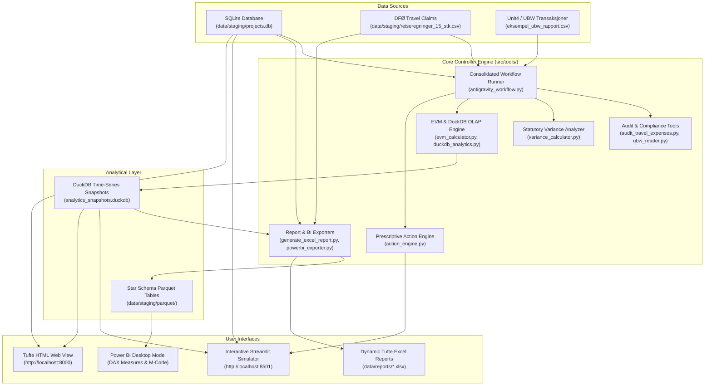

# UiA Controller App (v19 Production Release)

[](https://www.python.org/)
[](https://duckdb.org/)
[](https://powerbi.microsoft.com/)
[](https://streamlit.io/)
[](https://www.docker.com/)
[](https://github.com/frankellingsen/UIA-Controller/actions)
[](docs/USER_GUIDE.md)

An agentic financial controlling & compliance application tailored for **Universitetet i Agder (UiA) Handelshøyskolen**, bridging Norwegian public sector regulations (**DFØ circulars, UBW/Unit4 ledgers, F-05-20 reserve management**) with capital project controlling (**DuckDB OLAP, Earned Value Management (EVM), composite EAC forecasting, prescriptive action simulation**), **2026 YTD Budget vs. Actuals reconciliation (tags: `test2026T1` for August and `2026T1sep` for September)**, **Automated Multi-Source Data Ingestion (`src/tools/data_ingestion.py`)**, **Enterprise Excel Data Model (`UiA_Controller_DataModel_2026.xlsx`)**, **Power BI Star Schema TMDL** data modeling, and a specialized 6-agent team (**Lead Controller, Compliance Auditor, Ledger Analyst, Excel Specialist, Power BI Specialist, Budget Specialist**).

> 📖 **Comprehensive Manual:** For full operational details, mathematical formulas, and step-by-step procedures, refer to the **[UiA Controller User & Operations Guide](docs/USER_GUIDE.md)**.


---

## 🏛️ System Architecture



---

## ✨ Key Capabilities

1. **Dual-Database Analytics Layer:**
   * **SQLite (`projects.db`):** Master records & raw ledger transaction audit logs.
   * **DuckDB (`analytics_snapshots.duckdb`):** High-performance OLAP engine for time-series snapshotting and multi-model EAC forecasting.

2. **Multi-Model EAC (Estimate at Completion) Engine:**
   * **Typical CPI Model:** $\text{EAC} = \frac{\text{BAC}}{\text{CPI}}$
   * **Composite CPI $\times$ SPI Model:** $\text{EAC} = \text{AC} + \frac{\text{BAC} - \text{EV}}{\text{CPI} \times \text{SPI}}$
   * **Weighted 80/20 Model:** $\text{EAC} = \text{AC} + \frac{\text{BAC} - \text{EV}}{0.8 \cdot \text{CPI} + 0.2 \cdot \text{SPI}}$

3. **Public Sector Regulatory Compliance:**
   * **F-05-20 Driftsavsetning:** Monitors the statutory 5.0% university carryover reserve limit. Automatically flags 12M NOK excess requiring KD application.
   * **DFØ Travel Expense Audit:** Automated scanning for self-approval breaches (4-eyes rule), missing meal deductions, and receipt thresholds (>100 NOK).

4. **Prescriptive Action Engine & Streamlit EOY Forecast Dashboard:**
   * Simulates project-level descoping ($ETC$ reductions), capital investment activation before 31.12 under F-05-20, and travel audit recoveries.
   * Interactive Streamlit dashboard (`src/tools/app.py`) with real-time sliders for university leadership.

5. **Power BI & Excel Export Engine:**
   * Automatically builds Star Schema Parquet & CSV tables (`Fact_EVM_Snapshots`, `Fact_UBW_Audit`, `Fact_Travel_Audit`, `Dim_Project`, `Dim_Date`).
   * Generates Edward Tufte-compliant dynamic Excel workbooks with live formulas.

6. **Tufte Data-Ink HTML Web Dashboard:**
   * Zero-dependency local dashboard accessible at `http://localhost:8000` with direct S-Curve labeling and no vertical gridlines.

---

## 🚀 Quick Start Guide

### Option A: Local Python Environment

```bash
# 1. Clone repository
git clone https://github.com/frankellingsen/UIA-Controller.git
cd UIA-Controller

# 2. Create & activate virtual environment
python -m venv .venv
source .venv/bin/activate  # On Windows: .venv\Scripts\Activate.ps1

# 3. Install dependencies
pip install -r requirements.txt

# 4. Run automated test suite (13 test cases)
python -m pytest tests -v

# 5. Run full month-end close workflow (Steps 1–6)
python src/tools/antigravity_workflow.py

# 6. Launch interactive Streamlit action simulator & dashboard
streamlit run src/tools/app.py

# Or launch lightweight local Tufte HTML dashboard
python -m http.server 8000
```

### Option B: Docker & Docker Compose (Recommended)

```bash
# Build and run containerized environment
docker-compose up --build
```
Open your browser to `http://localhost:8000` to view the dashboard.

---

## 📂 Project Directory Structure

```
UIA-Controller/
├── Dockerfile                      # Multi-stage Docker build file
├── docker-compose.yml              # Container orchestration spec
├── pyproject.toml                  # Python packaging configuration
├── requirements.txt                # Pinned dependencies
├── index.html                      # Tufte-compliant HTML dashboard
├── README.md                       # Repository documentation
├── .gitignore                      # Git exclusion rules
├── .github/
│   └── workflows/
│       └── ci.yml                  # GitHub Actions CI workflow
├── .agents/                        # Agent definitions & custom controller skills
│   ├── agents.md                   # Controller personas (Lead Controller, Auditor, Analyst)
│   └── skills/                     # Domain controlling skills (DFØ, EVM, Power BI, Tiltak)
├── .antigravity/                   # Antigravity knowledge base & controlling SOPs
│   └── knowledge/
├── workflows/                      # Month-end & audit execution workflows
│   ├── implementation_plan_revisjon.md
│   └── run_close.md                # Standardized month-end close SOP
├── src/
│   └── tools/                      # Core controller calculation & export tools
│       ├── action_engine.py        # Prescriptive action simulation & EOY balance forecast
│       ├── antigravity_workflow.py # 6-step consolidated month-end close runner
│       ├── app.py                  # Streamlit interactive controlling dashboard
│       ├── audit_travel_expenses.py# DFØ travel expense compliance audit
│       ├── duckdb_analytics.py     # DuckDB OLAP snapshotting engine
│       ├── evm_calculator.py       # Earned Value Management metric formulas
│       ├── generate_excel_report.py# openpyxl Tufte-compliant Excel report builder
│       ├── powerbi_exporter.py     # Parquet / Star Schema exporter
│       ├── ubw_reader.py           # Unit4 / UBW transaction audit reader
│       └── variance_calculator.py  # F-05-20 reserve & variance analysis
├── powerbi/                        # Power BI data modeling & DAX library
│   ├── build_powerbi_dataset.py    # Power BI dataset automation script
│   ├── dax_measures.dax            # 20+ DAX measures library
│   ├── manifest.json               # Export manifest summary
│   ├── power_query_m_code.m        # Power Query M ingestion script
│   └── UiA_Controller_DataModel_Spec.md # Star Schema documentation
├── data/
│   ├── reports/                    # Generated Excel reports (.xlsx)
│   ├── staging/                    # SQLite (projects.db), DuckDB, & raw audit CSVs
│   │   └── parquet/                # Exported Parquet & CSV Star Schema tables
│   └── *.csv                       # Institutional dimension & fact datasets
├── docs/                           # Architecture, guides, and audit reports
│   ├── USER_GUIDE.md               # Complete operational & technical manual
│   ├── architecture/               # AI & agentic office design notes
│   ├── guides/                     # Streamlit & Power BI setup documentation
│   └── reports/                    # Executive summaries, action plan & audit walkthroughs
├── Regelverk/                      # Statutory regulations, circulars & audit matrices
│   ├── notater/                    # Condensed Norwegian public sector controlling notes
│   └── *.pdf, *.xlsx               # DFØ circulars, SRS, F-05-20, UiA control matrices
└── tests/                          # Automated pytest verification suite (13 test cases)
```

---

## 📊 Power BI Integration

1. Run `python powerbi/build_powerbi_dataset.py` to populate `data/staging/parquet/`.
2. Import Parquet files into **Power BI Desktop**.
3. Apply the DAX measures provided in [`powerbi/dax_measures.dax`](powerbi/dax_measures.dax).
4. Review the data model architecture in [`powerbi/UiA_Controller_DataModel_Spec.md`](powerbi/UiA_Controller_DataModel_Spec.md).

---

## 🧪 Automated Testing

Verify system integrity anytime with pytest:
```bash
python -m pytest tests -v
```
Checks database connections, EVM formula precision, F-05-20 thresholds, travel audit rules, Parquet exports, and the action simulation engine.

---

## 👤 Author & Governance

* **Lead Author:** Frank Ellingsen (Financial Controller / BI Specialist)
* **Domain:** Project Controlling, Public Sector Regulations (DFØ / SRS), Earned Value Management (EVM)
* **License:** MIT License
